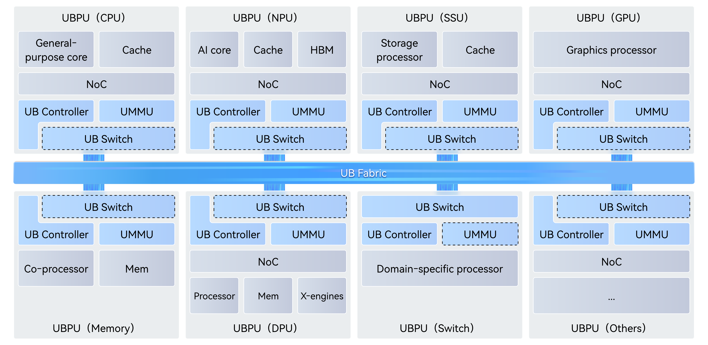

# ns-3-UB: UnifiedBus Network Simulation Framework

**Language**: [English](README_en.md) | [中文](README.md)

> **[NEW] Version 1.1.0 Released** · Check [Release Notes](RELEASE_NOTES_UB.md) for major updates

**Quick Start**: [QUICK_START_en.md](QUICK_START_en.md)

**UB Config-Driven Entry**: See [scratch/README.md](scratch/README.md)

## Project Overview

`ns-3-UB` is an ns-3 simulation module built based on the [UnifiedBus (UB) Base Specification](https://www.unifiedbus.com/zh). It implements the protocol frameworks and stack including the function layer, transaction layer, transport layer, network layer, and data link layer defined in the UB Base Specification. This project aims to provide a simulation platform for protocol innovation, network architecture exploration, and research on network algorithms such as congestion control, flow control, load balancing, and routing algorithms.

> **Note**: The English version of the UB specification is currently in "Coming Soon" status. Although every effort has been made to align with the UB Base Specification, differences still exist. Please refer to the UB Base Specification as the authoritative guide.

`ns-3-UB` can be used as a simulation tool for UB-based research, including but not limited to:
- Topology innovations to achieve traffic pattern affinity, low-cost and/or high reliability.
- Optimizations for collective communication operators and traffic engineering algorithms.
-	New techniques to define and ensure the transaction layer ordering and achieve higher reliability.
-	New transport techniques for memory semantics in a SuperPoD.
-	Innovations in other research areas like adaptive routing, load balancing, congestion control, and QoS optimization algorithms.


> This project provides pluggable "reference implementations" for policies/algorithms not specified in the UB Base Specification (such as switch modeling, route selection, congestion marking, buffering, and arbitration, etc.). These reference implementations are not part of the UB Base Specification and are only used as examples/baselines that can be replaced or disabled.
>
> Functions not implemented in this project include, but are not limited to: detailed modeling for hardware internals, physical layer, performance parameters, control plane behavior (such as initialization behavior, error and exception event handling, etc.), memory management, security policies, etc.

The **typical simulation functionalities** supported by this project are shown in the following table.

<table>
  <thead>
    <tr>
      <th align="center">Layer</th>
      <th align="center">Capability Category</th>
      <th align="left">Supported Features</th>
      <th align="left">Incomplete / User-Customizable Features</th>
    </tr>
  </thead>
  <tbody>
    <tr>
      <td align="center" rowspan="2">Function Layer</td>
      <td>Functions</td>
      <td>Load/Store interface, URMA interface</td>
      <td>URPC, Entity-related advanced features</td>
    </tr>
    <tr>
      <td>Jetty</td>
      <td>Jetty, many-to-many / one-to-one communication models</td>
      <td>Jetty Group, Jetty state machine</td>
    </tr>
    <tr>
      <td align="center" rowspan="3">Transaction Layer</td>
      <td>Service Modes</td>
      <td>ROI, ROL, UNO</td>
      <td>ROT</td>
    </tr>
    <tr>
      <td>Transaction Ordering</td>
      <td>NO / RO / SO</td>
      <td>—</td>
    </tr>
    <tr>
      <td>Transaction Types</td>
      <td>Write, Read, Send</td>
      <td>Atomic, Write_with_notify, etc.</td>
    </tr>
    <tr>
      <td align="center" rowspan="4">Transport Layer</td>
      <td>Service Modes</td>
      <td>RTP</td>
      <td>UTP, CTP</td>
    </tr>
    <tr>
      <td>Reliability</td>
      <td>PSN, timeout retransmission, Go-Back-N</td>
      <td>Selective retransmission, fast retransmission</td>
    </tr>
    <tr>
      <td>Congestion Control</td>
      <td>RTP congestion control mechanism, CAQM</td>
      <td>LDCP, DCQCN algorithm, CTP congestion control mechanism</td>
    </tr>
    <tr>
      <td>Load Balancing</td>
      <td>RTP load balancing: TPG mechanism, per-TP / per-packet load balancing, out-of-order reception</td>
      <td>CTP load balancing</td>
    </tr>
    <tr>
      <td align="center" rowspan="5">Network Layer</td>
      <td>Packet Format</td>
      <td>Support for IPv4 address format-based headers, 16-bit CNA address format-based headers</td>
      <td>Other header formats</td>
    </tr>
    <tr>
      <td>Address Management</td>
      <td>CNA to IP address translation, Primary / Port CNA</td>
      <td>User-customizable address allocation and translation strategies</td>
    </tr>
    <tr>
      <td>Routing</td>
      <td>Basic routing strategy based on destination address + header RT field, routing strategy based on path Cost, Hash-based ECMP, per-flow / per-packet Hash based on load balancing factors, load-aware adaptive routing</td>
      <td>User-customizable routing strategies</td>
    </tr>
    <tr>
      <td>Quality of Service</td>
      <td>SL-VL mapping, SP/DWRR-based inter-VL scheduling</td>
      <td>User-customizable inter-VL scheduling strategies</td>
    </tr>
    <tr>
      <td>Congestion Notification</td>
      <td>CAQM marking mode based on header CC field</td>
      <td>FECN / FECN_RTT marking modes</td>
    </tr>
    <tr>
      <td align="center" rowspan="3">Data Link Layer</td>
      <td>Packet Transmission</td>
      <td>Packet-level modeling</td>
      <td>Cell / Flit level modeling</td>
    </tr>
    <tr>
      <td>Virtual Channels</td>
      <td>Point-to-point links support up to 16 VLs, SP/DWRR-based inter-VL scheduling</td>
      <td>User-customizable inter-VL scheduling strategies</td>
    </tr>
    <tr>
      <td>Credit Flow Control</td>
      <td>Credit exclusive mode, CBFC, PFC adaptation</td>
      <td>Control plane credit initialization behavior, credit sharing mode</td>
    </tr>
  </tbody>
</table>

## Project Architecture

```
├── README.md                   # Project documentation
├── scratch/                    # Simulation examples and test cases
│   ├── ub-quick-example.cc     # Main simulation program
│   ├── 2nodes*/             	# simple 2-node topology test cases
│   ├── clos*/                  # CLOS topology test cases
│   └── 2dfm4x4*/               # 2D FullMesh 4x4 test case set
│
└── src/unified-bus/            # UB Base Specification-based simulation components
    ├── model/                  
    │   ├── protocol/
    │   │   └── ub-*            # Protocol stack related modeling components
    │   └── ub-*                # Network element and algorithm components
    ├── test/                   # Unit tests
    └── doc/                    # Documentation and diagrams
```

## Key Components

### 1. UnifiedBus (UB) Module

The UB module is a simulation component implemented based on the UB Base Specification:

#### Modeling Components for Network Elements
<p align="center">

<br>
<em>UB Domain system architecture diagram.</em><em> Source: www.unifiedbus.com</em><br>
</p>

- **UB Controller** (`ub-controller.*`) - Key component for executing the UB protocol stack, providing user interfaces
- **UB Switch** (`ub-switch.*`) - Used for data forwarding between UB ports
- **UB Port** (`ub-port.*`) - Port abstraction, handling packet input and output
- **UB Link** (`ub-link.*`) - Point-to-point connections between nodes

#### Protocol Stack Components
- **Programming Interface Instances** (`ub-api-ldst*`, `ub-app.*`) - Load/Store and URMA programming interface instances, interfacing with the programming models defined in the function layer
- **UB Function** (`ub-function.*`) - Function layer protocol framework implementation, supporting Load/Store and URMA programming models
- **UB Transaction** (`ub-transaction.*`) - Transaction layer protocol framework implementation
- **UB Transport** (`ub-transport.*`) - Transport layer protocol framework implementation
- **UB Network** (composed of `ub-routing-table.*`, `ub-congestion-control.*`, `ub-switch.*` functionalities) - Network layer protocol framework implementation
- **UB Datalink** (`ub-datalink.*`) - Data link layer protocol framework implementation

#### Network Algorithm Components
- **Traffic Injection Component** (`ub-traffic-gen.*`) - Reads user traffic configuration and injects traffic for simulation nodes according to specified serial and parallel relationships
- **TP Connection Manager** (`ub-tp-connection-manager.h`) - TP Channel manager, facilitating user's lookup of TP Channel information for each node
- **Switch Allocator** (`ub-allocator.*`) - Modelling the whole process of output port lookup for packets in a switch
- **Queue Manager** (`ub-buffer-manager.*`) - Buffer management module, affecting load balancing, flow control, queuing, packet dropping, and other behaviors
- **Routing Process** (`ub-routing-process.*`) - Routing module, implementing routing table management and query functionality
- **Congestion Control** (`ub-congestion-control.*`) - Framework module for congestion control algorithms
- **CAQM Algorithm** (`ub-caqm.*`) - C-AQM congestion control algorithm implementation
- **Flow Control** (`ub-flow-control.*`) - Flow control framework module
- **Fault Injection Module** (`ub-fault.*`) - Fault injection module for applying fault-related parameters (e.g., packet loss rate, high latency, congestion levels, packet errors, transient disconnections, lane reduction) to specific traffic

#### Data Types and Tools
- **Datatype** (`ub-datatype.*`) - UB data type definitions
- **Header** (`ub-header.*`) - UB protocol header definition and parsing
- **Network Address** (`ub-network-address.h`) - Network address related utility functions, including address translation, mask matching and other functionalities

### 2. Core Simulation Features

#### Topology and Traffic Support
- **Arbitrary Topology**: Supports simulation and modeling of arbitrary topologies. Users can quickly build topologies and routing tables using UB toolsets
- **Arbitrary Traffic**: Supports configuration of arbitrary simulation traffic. Users can quickly build collective communications and communication operator graphs using UB toolsets in conjunction with UbClientDag
- **Performance Monitoring**: Comprehensive performance metric collection and analysis

#### Protocol Stack Modeling
- **UB Protocol Stack**: Supports protocol stack modeling across the data link, network, transport, transaction, and function layers
- **Memory Semantics**: Implements Load/Store-based memory semantic behavior modeling
- **Message Semantics**: Implements URMA-based message semantic behavior modeling
- **Native Multipathing**: Implements native multipath support through TP/TP Group protocol mechanisms

#### Protocol Algorithm Support
- **Flow Control**: Implements a credit-based flow control mechanism framework, compliant with PFC
- **Congestion Control**: Implements the framework of the well-known congestion control loop, including network-side marking, receiver response, sender response, and congestion control algorithms; supports the C-AQM algorithm
- **Routing Policies**: Supports shortest-path routing and bypass strategies; supports packet spraying, ECMP, and other load balancing mechanisms
- **QoS Support**: Provides end-to-end QoS support, currently supporting the SP traffic scheduling policy
- **Switch Arbitration**: Modular implementation of the UB Switch arbitration mechanism, currently supporting priority-based SP scheduling

### 3. Script Toolset

Provides the complete network simulation workflow to support:

- **Network Topology Generation**: Automatically generates various network topologies (CLOS, 2D FullMesh, etc.)
- **Traffic Pattern Generation**: Supports All-Reduce, All-to-All, All-to-All-V, and other communication patterns; supports multiple collective communication algorithms like RHD, NHR, and OneShot
- **Performance Analysis Tools**: Throughput calculation, latency analysis, CDF plotting
- **Formatted Result Output**: Automatically generates basic result information tables for flow completion time, bandwidth, etc., with optional generation of packet-level, hop-by-hop information within the network

### 4. Repo-local OpenUSim Skills

This repository also maintains a repo-local set of OpenUSim skills under ` .codex/skills/ `.

These skills are not a standalone toolkit. They are an agent-facing entrypoint for the current `ns-3-ub` working tree and split the experiment workflow into bounded stages:

- `openusim-welcome`: checks startup facts from [README_en.md](README_en.md) and [QUICK_START_en.md](QUICK_START_en.md), then helps with a bounded Quick Start smoke run
- `openusim-plan-experiment`: converges a natural-language goal into one stable `experiment-spec.md`
- `openusim-run-experiment`: reuses `./ns3`, `scratch/ub-quick-example`, and `scratch/ns-3-ub-tools/` to generate a case, write `network_attribute.txt`, run the simulation, and surface explicit execution errors
- `openusim-analyze-results`: interprets outputs against the original experiment goal and helps identify likely causes for the next iteration

Because of that, they are maintained together with the main repo and the `ns-3-ub-tools` submodule instead of as a separate submodule.

## License

This project follows the ns-3 license agreement, GPL v2. See the `LICENSE` file for details.

## Citation
```bibtex
@software{UBNetworkSimulator,
  month = {10},
  title = {{ns-3-UB: UnifiedBus Network Simulation Framework}},
  url = {https://gitcode.com/open-usim/ns-3-ub},
  version = {1.0.0},
  year = {2025}
}
```
<a href='https://mapmyvisitors.com/web/1c1da'  title='Visit tracker'></a>
